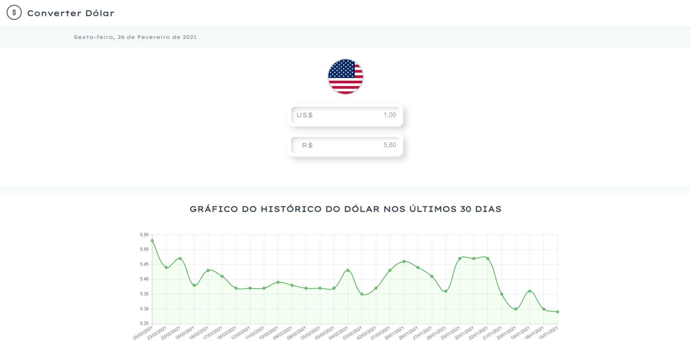

  <h3 align="center">Converter Dólar</h3>

---

## Overview

Simple project to better understand how Next.js works, the project consists of convert USD/BRL.

## Preview

## APIs

- [AwesomeApi](https://docs.awesomeapi.com.br/api-de-moedas)

## Running the project

- Clone this repository
- Install all dependencies using the command `yarn`
- Run `yarn run dev`
- Access http://localhost:3000/

## Used technologies

- Next.js
- Axios
- React ChartJs 2
- Other React JS libs
